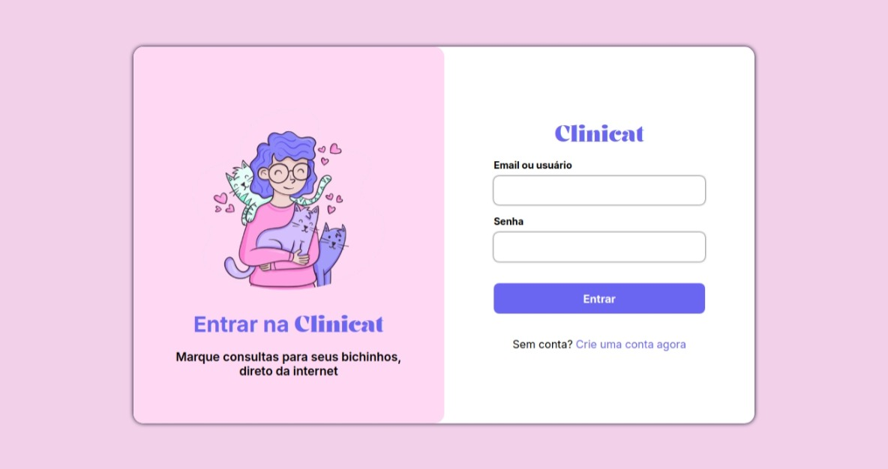
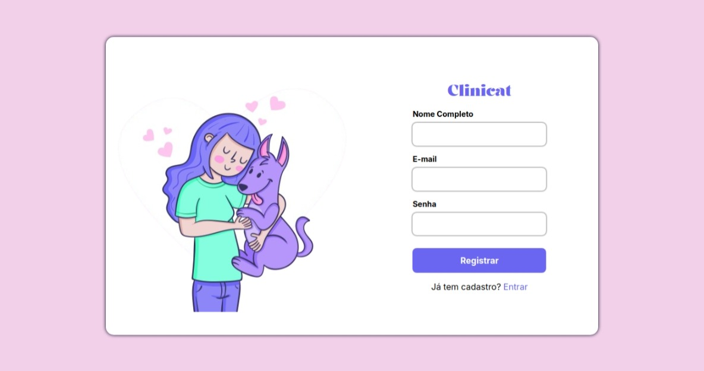
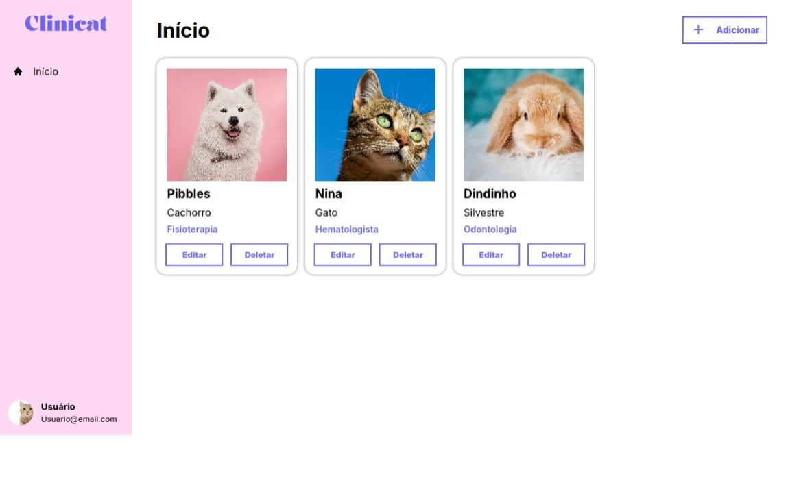

# Mini-projeto do módulo M2: Clinicat

Projeto criado como atividade prática do curso fullstack da Programadores do Amanhã.  
Clinicat é um site para agendamento de cadastramento de pets e consultas.
### O site permite que você:

- Faça seu cadastro
- Realize login com seus dados
- Cadastre seus pets com nome, especialidade e raça
- Edite as informações do seu pet
- Remova seu pet

## Screenshots

### Tela de login

### Tela de registro

### Tela incial

